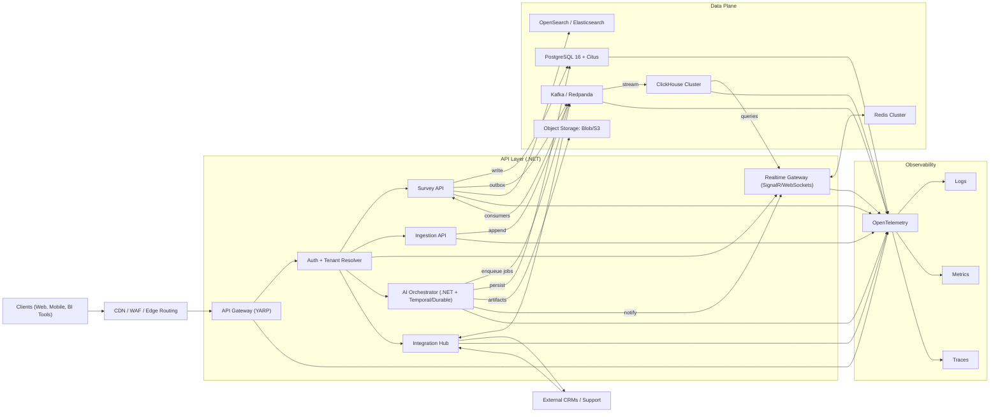
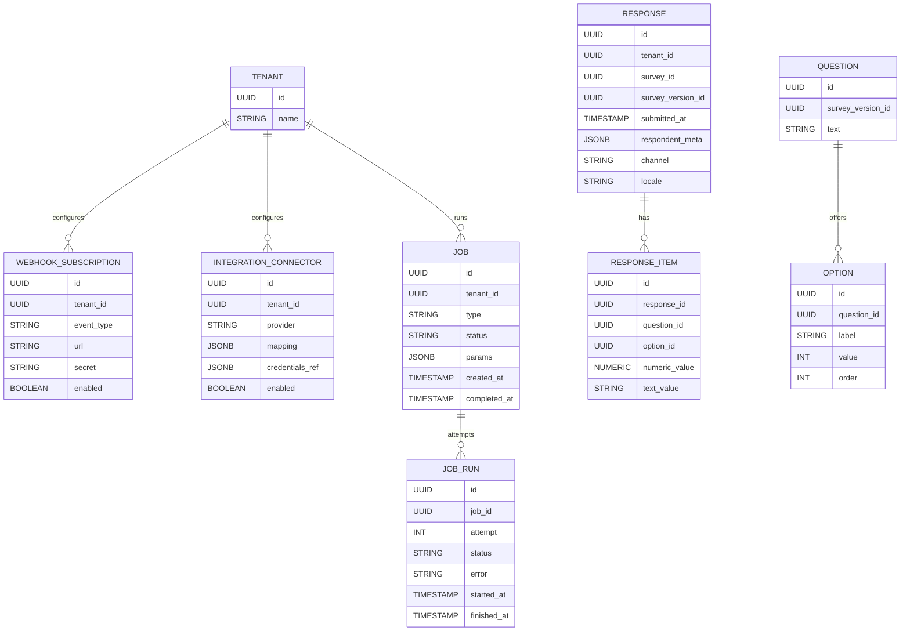
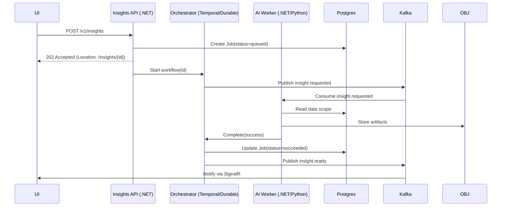
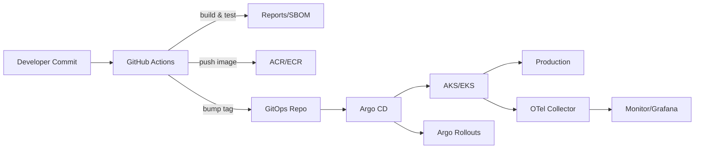

# Howazit Global Expansion — Architecture

_Date:_ 2025‑09‑17  
_Author:_ Genady Shmunik  

## Executive Summary

Howazit must scale from ~100K → 1M survey responses/day, enforce strict multi‑tenancy isolation, power real‑time dashboards, run long‑running AI insight jobs (≥30s), and integrate with 50+ external systems. This design is **.NET 8/9‑centric** and **cloud‑portable** (Azure/AWS), using an **event‑driven, CQRS** approach:

- **Ingress:** CDN/WAF → YARP API Gateway → Auth & Tenant Resolver.
- **Data plane:** Kafka/Redpanda for durable streams; PostgreSQL 16+Citus for OLTP; ClickHouse for analytics; Redis for cache/realtime; object storage for raw/AI artifacts.
- **Compute plane:** Kubernetes‑orchestrated .NET microservices; SignalR for realtime; Temporal/Durable Task for long‑running workflows.
- **Integration plane:** Connector Hub (webhooks/polling), outbox + DLQ, per‑tenant secrets.

This balances reliability (idempotency, backpressure), speed (near‑real‑time aggregates), and isolation (RLS + schema/DB‑per‑tenant for gold tier).

## 1) High‑Level System Architecture Diagram



 **Key patterns:** 
 API Gateway, Stateless Services, Event Streams, Outbox, CQRS (OLTP writes, columnar reads), SignalR Realtime, Workflow Orchestration, GitOps.
___

## 2) Technology Choices (within .NET 8–9 + Azure/AWS)

- **Runtime & APIs:** **.NET 8/9**, ASP.NET Core **Minimal APIs**, **gRPC** for internal hops, **HTTP/3** (Kestrel). Prefer **Native AOT** for lightweight workers/ingesters.
- **Resilience:** ASP.NET Core **Rate Limiting** middleware; **Polly** for retry/timeout/circuit breakers; `System.Threading.Channels` for in‑process pipelines.
- **Auth & Multitenancy:** OIDC/OAuth2 (Entra ID/Cognito/Okta), JWT with `tenant_id`; Authorization Policies + EF Core global query filters; connection resolver for **schema/DB‑per‑tenant** (gold) vs **RLS** in shared tier.
- **Messaging:** **Kafka/Redpanda** (MSK on AWS, self/managed on Azure). .NET **Confluent.Kafka** client. **Outbox** via EF Core; **KEDA** scales consumers on lag.
- **OLTP:** **PostgreSQL 16** with **Citus** (Azure Flexible Server / AWS RDS + Citus) sharded by `tenant_id`; monthly partitions on `responses`.
- **Analytics:** **ClickHouse** on K8s (Altinity/Cloud) with **Materialized Views** for near‑real‑time dashboards.
- **Cache & Realtime:** **Redis** (Azure Cache / ElastiCache) for hot aggregates, idempotency keys, rate limits; **SignalR** with Redis backplane.
- **Search (optional):** OpenSearch/Elasticsearch for full‑text over comments.
- **AI Orchestration:** **Temporal** (.NET SDK) or **Durable Task/Functions**; workers in .NET or Python; artifacts to Blob/S3.
- **Secrets/Identity:** **Azure Key Vault** / **AWS Secrets Manager** + CSI driver; Managed Identity / IAM Roles for Service Accounts.
- **Platform:** **AKS/EKS**, HPA, **KEDA**, PodDisruptionBudgets, **NGINX/AGIC/ALB Ingress**.
- **Observability:** **OpenTelemetry** (auto/manual for .NET), Azure Monitor/CloudWatch, Prometheus/Grafana; use **.NET Aspire** for local multi‑service orchestration.

**_Rationale:_**
Modern .NET 8/9 capabilities (Native AOT, HTTP/3, rate limiting, gRPC, Aspire) with battle‑tested data/streaming systems.

---

## 3) Data Architecture Strategy

### 3.1 Ingestion & Storage
1. **Ingress:** `POST /v1/ingest/responses` authenticates, resolves `tenant_id`, and persists a minimal audit record.
2. **Durable queue:** Produce to `responses.raw` (Kafka) with **Idempotency-Key** (dedup via Redis).
3. **Consumers:** .NET processors validate, enrich (geo/device), **upsert OLTP** (`responses`, `response_items`).
4. **Outbox → Kafka:** Within same OLTP tx, append `response.created` to outbox; dispatcher publishes to Kafka.
5. **Analytics sink:** Stream to ClickHouse flat **fact** table; MV update near‑real‑time dashboards.

### 3.2 Multi‑Tenant Isolation
- **Standard tier (shared):** Single Citus cluster with **RLS** on `tenant_id`; all tables include `tenant_id`. EF Core injects tenant filter automatically.
- **Gold tier:** **Schema/DB‑per‑tenant** with connection switcher; dedicated compute and data residency options.
- **PII:** At‑rest encryption (TDE), in‑transit TLS; optional app‑level cryptography for sensitive fields.

### 3.3 Analytics Modeling (ClickHouse)
- **Fact:** `events_response(tenant_id, survey_id, question_id, option_id, ts, numeric_value, text_value, dims JSON, locale, channel)`.
- **Views:** `mv_response_counts_5m`, `mv_nps_by_segment_daily`, `mv_csats_by_region`.
- **Dims:** tenants, surveys, questions (slowly changing, upserted).

### 3.4 Real‑Time vs Batch
- **Realtime:** Kafka → ClickHouse (1–5s lag) + Redis counters for ultra‑fresh widgets; push via SignalR.
- **Batch:** Nightly compaction/roll‑ups to Parquet in Blob/S3; replay Kafka for backfills.

---

## 4) Scaling Strategy
### 4.1 Horizontal Scaling
- **Stateless services:** HPA (CPU/RPS) and **KEDA** (Kafka lag). Backpressure via Kafka. Retries with jitter.
- **Idempotency:** Request keys + dedupe cache for safe at‑least‑once semantics.
### 4.2 Database Partitioning/Sharding
- **PostgreSQL + Citus:** Distribute by `tenant_id` (hash). Partition `responses` by month. Hot tenants can be **moved** to dedicated nodes.
- **ClickHouse:** Cluster by `(tenant_id, survey_id, toYYYYMM(ts))`; TTL for cold tiers.

### 4.3 Caching Layers
- **Edge:** CDN caching for static and selected GET APIs (ETag/Cache‑Control).
- **App:** Redis for hot aggregates, tokens, rate limits, features.
- **Analytics:** ClickHouse query cache + Materialized Views.

### 4.4 Global CDN/Regions
- **CDN:** Cloudflare/Akamai; geo‑routing; WAF.
- **Regions:** Active/active stateless; data pinned per residency needs; Kafka geo‑replication for lawful topics.

---

## 5) Integration Architecture (50+ systems)

- **Connector Hub:** .NET service with pluggable adapters (Salesforce, Zendesk, HubSpot, ServiceNow, etc.).
- **Triggers:** Kafka events (`response.created`, `insight.ready`); per‑tenant mapping rules (JSON templates/JS sandbox).
- **Delivery:** Webhooks (HMAC), REST push, or polling. **Exponential backoff**, **DLQ**, replay tooling.
- **Idempotency:** External correlation keys stored to avoid duplicates.
- **Secrets/Config:** Key Vault/Secrets Manager; per‑tenant secure config; rotation policies.
- **Metrics/Tracing:** Per‑tenant delivery metrics; trace context propagated end‑to‑end.

---

## Database Schema Design (key entities)


**Indexes & policies (Postgres):** 
Composite indexes on `responses(tenant_id, submitted_at)`, `response_item(response_id)`,
`responses(survey_id, submitted_at)`; RLS policy `tenant_id = current_setting('app.tenant')::uuid`; monthly partitions; Citus distribution key `tenant_id`.

---

## API Contract Examples (critical endpoints)

```yaml
openapi: 3.0.3
info:
  title: Howazit Core APIs
  version: v1
servers:
  - url: https://api.howazit.com

components:
  securitySchemes:
    OAuth2:
      type: oauth2
      flows:
        clientCredentials:
          tokenUrl: https://auth.howazit.com/oauth/token
          scopes:
            responses:write: Ingest responses
            insights:write: Create insight jobs

security:
  - OAuth2: []

paths:
  /v1/ingest/responses:
    post:
      summary: Ingest a survey response
      parameters:
        - in: header
          name: Idempotency-Key
          required: true
          schema:
            type: string
      requestBody:
        required: true
        content:
          application/json:
            schema:
              $ref: '#/components/schemas/ResponseIngest'
      responses:
        '202':
          description: Accepted
        '409':
          description: Duplicate (idempotent)

  /v1/insights:
    post:
      summary: Create AI insight job
      requestBody:
        required: true
        content:
          application/json:
            schema:
              $ref: '#/components/schemas/InsightRequest'
      responses:
        '202':
          description: Job accepted
          headers:
            Location:
              schema:
                type: string

  /v1/insights/{jobId}:
    get:
      summary: Get AI insight job status/result
      parameters:
        - in: path
          name: jobId
          required: true
          schema:
            type: string
            format: uuid
      responses:
        '200':
          description: Job status or result
          content:
            application/json:
              schema:
                oneOf:
                  - $ref: '#/components/schemas/JobStatus'
                  - $ref: '#/components/schemas/InsightResult'

components:
  schemas:
    ResponseIngest:
      type: object
      required: [surveyId, submittedAt, answers]
      properties:
        surveyId:
          type: string
          format: uuid
        submittedAt:
          type: string
          format: date-time
        answers:
          type: array
          items:
            type: object
            required: [questionId]
            properties:
              questionId:
                type: string
                format: uuid
              optionId:
                type: string
                format: uuid
                nullable: true
              numericValue:
                type: number
                nullable: true
              textValue:
                type: string
                nullable: true

    InsightRequest:
      type: object
      required: [surveyId, timeframe]
      properties:
        surveyId:
          type: string
          format: uuid
        timeframe:
          type: object
          properties:
            from:
              type: string
              format: date-time
            to:
              type: string
              format: date-time
        segments:
          type: array
          items:
            type: string
        questions:
          type: array
          items:
            type: string
            format: uuid

    JobStatus:
      type: object
      properties:
        id:
          type: string
          format: uuid
        status:
          type: string
          enum: [queued, running, succeeded, failed]
        progress:
          type: number
          minimum: 0
          maximum: 100

    InsightResult:
      type: object
      properties:
        id:
          type: string
          format: uuid
        status:
          type: string
          enum: [succeeded]
        findings:
          type: array
          items:
            type: object
        artifacts:
          type: array
          items:
            type: string
            format: uri

```

---

## AI Insight Workflow (sequence)




## Appendix
### Testing Strategy
- **Unit:** xUnit + FluentAssertions; high‑value services/handlers/mappers.
- **Integration:** `WebApplicationFactory` for APIs; **Testcontainers** for Postgres/Kafka/Redis/ClickHouse in CI.
- **Contract:** **Pact** for connectors/internal APIs.
- **E2E/UI:** Playwright; smoke probes post‑deploy.
- **Performance:** **k6** (ingest and dashboard queries); SLO‑gated.
- **Chaos:** Azure Chaos Studio / AWS FIS drills (broker/DB failover, network faults).
- **Security:** CodeQL, Dependabot, Trivy/ECR scans, secret scanning, image signing.
### CI/CD Overview

---

## Non‑Functional Considerations
- **Security:** WAF, OAuth scopes, HMAC‑signed Webhooks, per‑tenant keys, PII minimization, DLP on exports.
- **SLOs:** 99.9% API; p95 ingest < 200ms at edge; realtime lag < 5s.
- **Compliance:** GDPR/DSR tooling; residency by tenant (gold tier binding to region); retention per tenant.
- **Testing:** Contract tests for connectors; chaos testing; load tests to 10× baseline.

---

## Risks & Mitigations
- **Hot tenants dominate shared cluster** → autoscale shards; move to dedicated DB.
- **Kafka backlogs** → KEDA‑based consumer scaling; partition rebalancing playbooks.
- **ClickHouse schema drift** → versioned schemas + compat views.
- **Connector API limits** → per‑connector rate limiting; adaptive backoff; DLQ + replay.
